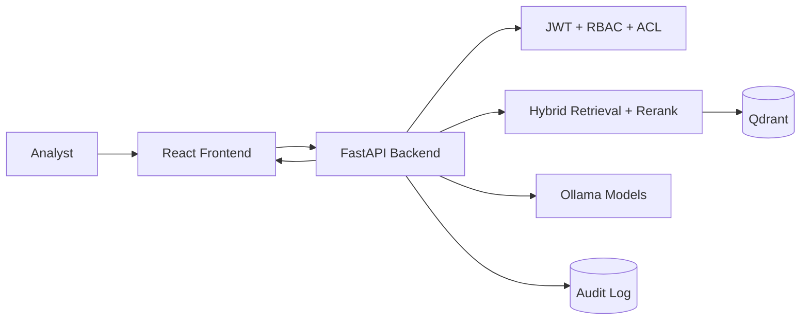

# Secure Finance LLM

Secure Finance LLM is an institutional RAG platform for financial document intelligence under strict governance constraints.
It is built for teams that need controlled access, auditable behavior, and high-signal answers from large report corpora.

## Recruiter Snapshot

- Built a full-stack financial AI platform: React frontend, FastAPI backend, Qdrant vector store, Ollama model runtime.
- Implemented policy-aware retrieval with RBAC and document-level ACL enforcement.
- Shipped a hybrid retrieval and reranking pipeline for better recall and ranking quality on long-form filings.
- Added production-oriented controls: audit logging, guardrails, Dockerized deployment, admin access workflows.
- Tuned ingestion and retrieval for large enterprise datasets (long annual reports, statements, internal research packs).

## Why This Matters

Financial research systems fail when they are either inaccurate or uncontrolled.
This project addresses both risks:

- Accuracy risk: hybrid retrieval and reranking reduce missed evidence and poor top-k ordering.
- Control risk: access policies are enforced before context reaches generation.
- Compliance risk: audit logs and explicit source grounding improve post-hoc reviewability.

## System Architecture



## Core Technical Design

### Security and Access Control

- JWT authentication at API boundary.
- Role-based access control for admin operations.
- Document-level ACL filtering in retrieval path.
- Policy checks before retrieval and generation.

### Retrieval and Reranking

1. Dense vector retrieval from Qdrant.
2. Lexical scoring over ACL-filtered candidates.
3. Reciprocal-rank style hybrid fusion.
4. Weighted second-stage reranking.
5. Source diversity pass to avoid redundant chunks from the same file.

### Ingestion and Indexing

- PDF ingestion with overlapping chunking for long documents.
- Per-chunk embeddings using Ollama embedding model.
- Qdrant upsert with metadata, ACL tags, and document identifiers.

## Technical Tradeoffs

- Hybrid + rerank vs vector-only:
	- Higher answer quality, slightly higher latency and compute.
- Overlapping chunking vs disjoint chunking:
	- Better context continuity, more storage and index volume.
- Local model runtime vs managed API:
	- Better data control, requires local model ops and capacity planning.

## Benchmarking and Evidence Template

Use this section to publish measured results for interviews and reviews.

| Metric | Baseline | Current | Delta |
|---|---:|---:|---:|
| Retrieval Recall at k | TBD | TBD | TBD |
| MRR / NDCG | TBD | TBD | TBD |
| Median Query Latency (ms) | TBD | TBD | TBD |
| P95 Query Latency (ms) | TBD | TBD | TBD |
| Hallucination Rate | TBD | TBD | TBD |
| Access-Control Violations | TBD | TBD | TBD |

## Quick Start (Docker)

From project root:

```bash
docker-compose -f infra/docker/docker-compose.yml up -d --build
```

Verify:

```bash
docker-compose -f infra/docker/docker-compose.yml ps
```

Endpoints:

- Frontend: http://localhost:3000
- Backend health: http://localhost:8000/health
- Backend LLM health: http://localhost:8000/health/llm
- Qdrant REST: http://localhost:6335
- Qdrant gRPC: localhost:6336

## Runtime Configuration

Key backend variables:

- JWT_SECRET
- QDRANT_HOST
- QDRANT_PORT
- LLM_BASE_URL
- LLM_MODEL
- EMBEDDING_MODEL

Large-corpus tuning:

- CHUNK_SIZE_WORDS=180
- CHUNK_OVERLAP_WORDS=40
- MIN_CHUNK_WORDS=20
- HYBRID_CANDIDATE_MULTIPLIER=8
- HYBRID_LEXICAL_POOL_LIMIT=1500
- HYBRID_RRF_K=60
- RERANK_DENSE_WEIGHT=0.60
- RERANK_LEXICAL_WEIGHT=0.40
- RERANK_FUSION_WEIGHT=0.35

## Production Readiness Checklist

- Replace demo login logic with real identity provider integration.
- Restrict CORS origins to approved domains.
- Rotate and externalize secrets in a vault.
- Encrypt storage volumes and enforce TLS in transit.
- Add CI checks for linting, tests, and security scanning.
- Publish benchmark results and regression thresholds.
- Add SLOs and alerting for query latency and error budgets.

## Operations

Stop services:

```bash
docker-compose -f infra/docker/docker-compose.yml down
```

Rebuild backend only:

```bash
docker-compose -f infra/docker/docker-compose.yml up -d --build backend
```
